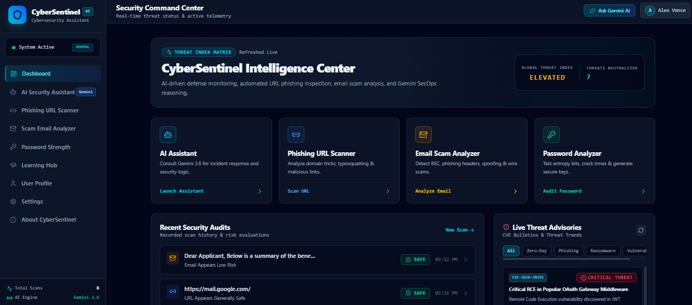
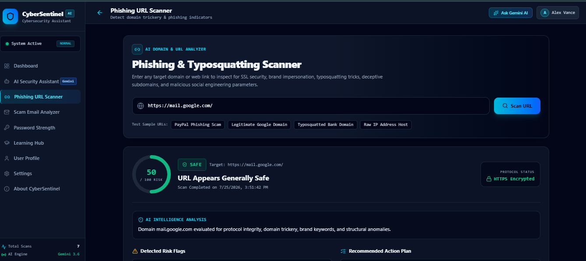
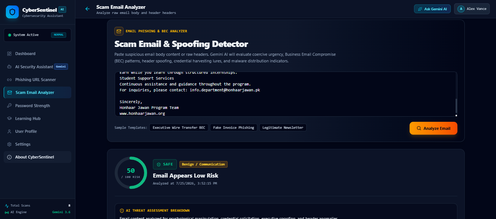
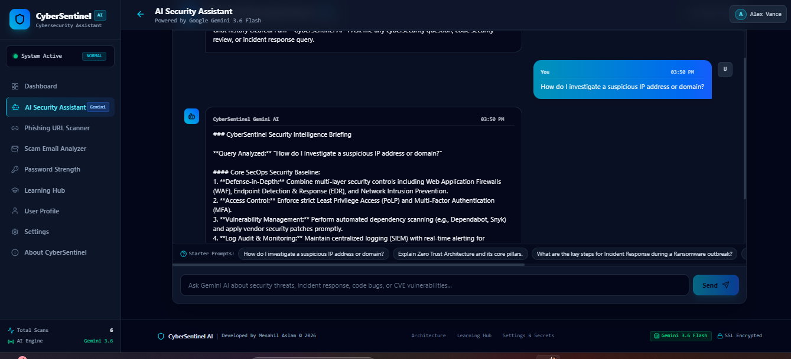

<div align="center">

# 🛡️ CyberSentinel

### Enterprise-Grade AI-Powered Cybersecurity & SecOps Intelligence Platform

[](https://cyber-sentinel-nu.vercel.app/)
[](https://github.com/MenahilAslam/CyberSentinel)
[](https://reactjs.org/)
[](https://ai.google.dev/)
[](https://tailwindcss.com/)
[](LICENSE)

<p align="center">
  <b>An intelligent, full-stack cybersecurity application designed to detect phishing links, analyze email scams, guide incident response, and train SecOps professionals.</b>
  <br />
  <i>Final Project by Menahil Aslam</i>
</p>

---

</div>

## 📌 Table of Contents

- [Overview](#-overview)
- [Key Features](#-key-features)
- [Architecture \& Tech Stack](#-architecture--tech-stack)
- [Screenshots](#-screenshots)
- [Live Demo \& Repository](#-live-demo--repository)
- [Getting Started](#-getting-started)
  - [Prerequisites](#prerequisites)
  - [Installation](#installation)
  - [Environment Variables](#environment-variables)
- [Usage](#-usage)
- [Project Structure](#-project-structure)
- [Future Improvements](#-future-improvements)
- [Contributing](#-contributing)
- [License](#-license)
- [Author](#-author)

---

## 🔍 Overview

**CyberSentinel** is an advanced enterprise-grade cybersecurity threat intelligence platform built to mitigate modern digital threat vectors such as spear-phishing, typosquatting, credential harvesting, business email compromise (BEC), and zero-day vulnerabilities.

Powered by **Google Gemini 3.6 Flash** via serverless backend API endpoints, CyberSentinel delivers real-time URL risk scoring, multi-layered email heuristic analysis, and actionable SecOps incident response playbooks within a sleek, high-contrast dark cybersecurity dashboard.

---

## ✨ Key Features

### 🌐 1. Automated URL Phishing Inspector
- **Heuristic \& Domain Analysis**: Detects IP-based hostnames, dynamic TLDs, typosquatting variants, excessive subdomains, and suspicious string patterns.
- **Gemini Threat Reasoning**: Performs deep semantic risk inspection with confidence scoring, threat classification, and remediation steps.
- **Visual Risk Gauge**: Displays real-time risk scores (0–100%) categorized into Low, Medium, High, and Critical alert levels.

### 📧 2. Email Scam \& BEC Analyzer
- **Header \& Domain Verification**: Validates SPF/DKIM alignment and alerts on mismatched `From` addresses vs actual envelope senders.
- **Social Engineering Detection**: Identifies urgency tactics, coercion keywords, wire transfer requests, and malicious payload links.
- **Extracted Artifact Indicators**: Automatically parses and lists all embedded URLs, IP addresses, and email targets found in body text.

### 🤖 3. SecOps Gemini AI Assistant
- **Context-Aware Cybersecurity Expert**: Provides professional advice on Zero Trust Architecture, Ransomware Outbreak Containment, Vulnerability Remediation, and Code Security Reviews.
- **Structured Markdown Responses**: Returns formatted technical advisories complete with shell commands, code blocks, and operational checklists.
- **Resilient Fallback Mode**: Ensures high availability with built-in SecOps baseline guidance during peak upstream API traffic.

### 🎓 4. Interactive Learning Hub \& Quizzes
- **Structured SecOps Curriculum**: Covers Web Application Security (OWASP Top 10), Email Defense, Network Security, and Incident Response.
- **Interactive Knowledge Checks**: Multi-choice threat scenario quizzes with detailed rationale for correct and incorrect answers.
- **Gamified Badges \& Skill Score**: Dynamic progression tracking with earned certifications and rank levels.

### 📊 5. Threat Intelligence Dashboard \& JSON Reporting
- **Live Threat Metrics**: Overview of total scans performed, malicious threats detected, and platform safety rating.
- **Exportable Security Audit Reports**: One-click JSON export containing full historical scan metrics and threat logs (`cybersentinel_report_*.json`).
- **Persistent Local Engine**: Client-side localStorage persistence for seamless audit history across sessions without external database latency.

---

# 🤖 AI Feature

CyberSentinel integrates **Google Gemini 3.6 Flash** to provide intelligent cybersecurity assistance. The AI analyzes user queries, explains cyber threats, and offers practical security recommendations.

## What the AI Does

- Analyzes cybersecurity-related questions.
- Explains phishing attacks and email scams.
- Provides incident response guidance.
- Recommends security best practices.
- Uses previous conversation context to improve response quality.
- Automatically provides a built-in security advisory if the AI service is temporarily unavailable.

## AI Instructions / System Prompt

The AI behavior is controlled through a **custom system prompt written specifically for this project**.

The AI is instructed to:

- Act as **CyberSentinel AI**, a Senior Cybersecurity Incident Responder, Threat Analyst, and Ethical Hacker.
- Provide accurate, professional, and actionable cybersecurity guidance.
- Use Markdown formatting with headings, bullet points, and code blocks where appropriate.
- Use previous conversation context when generating responses.
- Focus only on cybersecurity topics.
- Recommend practical mitigation steps and security best practices.
- Generate comprehensive, educational, and well-structured responses.

**AI Model:** Google Gemini 3.6 Flash

---
## 🛠️ Technologies Used

### Frontend Stack
| Technology | Description |
| :--- | :--- |
| **React 18** | UI component architecture and state management |
| **TypeScript** | Strict static type checking and modular interface definitions |
| **Vite** | Fast, modern frontend build tool and dev server |
| **Tailwind CSS** | Custom utility-first styling with high-contrast cyber dark theme |
| **Lucide React** | Clean, responsive vector icon set |
| **Motion** | Fluid layout transitions and interactive UI state animations |

### Backend \& Serverless API
| Technology | Description |
| :--- | :--- |
| **Vercel Serverless Functions** | Lightweight Node.js edge/serverless API routes (`/api/*`) |
| **@google/genai SDK** | Official Google Gemini AI SDK for server-side threat reasoning |
| **Express Middleware Layer** | Route proxying and dev server integration |

---


## 📸 Screenshots

| Dashboard | URL Scanner |
| :---: | :---: |
|  |  |

| Email Analyzer | AI Assistant |
| :---: | :---: |
|  |  |
## 🔗 Live Demo \& Repository

- 🚀 **Live Application**: [https://cyber-sentinel-nu.vercel.app/](https://cyber-sentinel-nu.vercel.app/)
- 📦 **GitHub Repository**: [https://github.com/MenahilAslam/CyberSentinel](https://github.com/MenahilAslam/CyberSentinel)

---

## 🚀 Getting Started

Follow these instructions to set up and run CyberSentinel locally on your machine.

### Prerequisites

Ensure you have the following installed on your system:
- **Node.js**: `v18.0.0` or higher
- **npm** or **bun** / **yarn** package manager

### Installation

1. **Clone the Repository**:
   ```bash
   git clone https://github.com/MenahilAslam/CyberSentinel.git
   cd CyberSentinel
   ```

2. **Install Dependencies**:
   ```bash
   npm install
   ```

3. **Configure Environment Variables**:
   Create a `.env` file in the root directory:
   ```bash
   cp .env.example .env
   ```

4. **Run Development Server**:
   ```bash
   npm run dev
   ```
   Open your browser and navigate to `http://localhost:3000`.

---

## 🔑 Environment Variables

To enable live Gemini AI threat analysis, set the `GEMINI_API_KEY` in your environment or Vercel dashboard:

```env
# .env.example
GEMINI_API_KEY=your_google_gemini_api_key_here
```

> **Note**: If `GEMINI_API_KEY` is not set, CyberSentinel seamlessly operates in **Demo / Baseline Mode**, utilizing internal SecOps heuristic intelligence without crashing.

---

## 💻 Usage

1. **Scan a Suspicious Link**: Navigate to the **URL Inspector** tab, paste any URL (e.g., `http://login-security-update.com`), and click **Analyze URL**.
2. **Inspect an Email**: Navigate to the **Email Analyzer** tab, paste raw email content or headers, and inspect threats, extracted links, and risk level.
3. **Consult AI Assistant**: Open the **AI Assistant** tab to ask technical questions regarding zero-trust policies, code vulnerability fixes, or incident response protocols.
4. **Take Quizzes**: Visit the **Learning Hub** to test your threat identification skills and earn SecOps badges.
5. **Export Audit Data**: Go to **Settings** and click **Export Full Security Audit Report (JSON)** to download a complete backup of all scan results.

---

## 📁 Project Structure

```
CyberSentinel/
├── api/                   # Vercel Serverless Function Endpoints
│   ├── _gemini.ts         # Google Gemini AI SDK Initialization & Wrappers
│   ├── _utils.ts          # Server-Side Heuristics & Pattern Analyzers
│   ├── analyze-email.ts   # Email Scam & BEC Analysis API
│   ├── chat.ts            # SecOps AI Assistant Chat API
│   ├── health.ts          # API System Status Check
│   └── scan-url.ts        # URL Phishing & Threat Inspection API
├── src/
│   ├── components/        # Reusable UI Components
│   │   ├── Navbar.tsx     # Header Navbar & Global Page Indicators
│   │   ├── Sidebar.tsx    # Responsive Desktop/Mobile Side Navigation
│   │   └── Footer.tsx     # Footer Branding & Copyright Info
│   ├── pages/             # Main Application Views
│   │   ├── DashboardPage.tsx    # Intelligence Center & Security Stats
│   │   ├── UrlInspectorPage.tsx # URL Phishing Analysis Tool
│   │   ├── EmailAnalyzerPage.tsx# Email Scam & BEC Analyzer Tool
│   │   ├── AssistantPage.tsx    # SecOps Gemini AI Assistant
│   │   ├── LearningHubPage.tsx  # Modules & Threat Quizzes
│   │   ├── ProfilePage.tsx      # User Score & Badges
│   │   ├── SettingsPage.tsx     # App Settings & JSON Report Exporter
│   │   └── AboutPage.tsx        # System Architecture & Specs
│   ├── utils/             # Client-Side Utilities & Local Engine
│   │   ├── heuristics.ts  # Client-Side Heuristic Fallback Analysis
│   │   └── storage.ts     # Client Persistence Engine (localStorage)
│   ├── types.ts           # Global TypeScript Definitions
│   ├── App.tsx            # Root Application Layout & Router
│   ├── main.tsx           # React DOM Entrypoint
│   └── index.css          # Tailwind CSS Global Imports
├── public/                # Static Public Assets
├── index.html             # HTML Template Entry Point
├── metadata.json          # App Metadata Configuration
├── package.json           # Dependencies & NPM Scripts
├── tsconfig.json          # TypeScript Compiler Options
├── vercel.json            # Vercel Serverless Route Rewrites
└── README.md              # Project Documentation
```

---

## 🔮 Future Improvements

- [ ] **SIEM Integration**: Export security alerts directly to Splunk, Elastic, or Microsoft Sentinel via Webhooks.
- [ ] **Real-Time Threat Feeds**: Integrate live threat feeds (VirusTotal, AlienVault OTX, AbuseIPDB API).
- [ ] **Multi-User Collaboration**: Add multi-tenant team workspaces with role-based access control (RBAC).
- [ ] **Browser Extension**: Develop a lightweight Chrome extension for instant web page phishing checks.

---

## 🤝 Contributing

Contributions, issues, and feature requests are welcome!

1. Fork the repository
2. Create your feature branch (`git checkout -b feature/AmazingFeature`)
3. Commit your changes (`git commit -m 'Add some AmazingFeature'`)
4. Push to the branch (`git push origin feature/AmazingFeature`)
5. Open a Pull Request

---

## 📄 License

This project is open-source and available under the [MIT License](LICENSE).

---

## 👤 Author

**Menahil Aslam**
- **GitHub**: [@MenahilAslam](https://github.com/MenahilAslam)
- **Project Link**: [https://github.com/MenahilAslam/CyberSentinel](https://github.com/MenahilAslam/CyberSentinel)
- **Live Demo**: [https://cyber-sentinel-nu.vercel.app/](https://cyber-sentinel-nu.vercel.app/)

---

<div align="center">
  <sub>Built with ❤️ as a Final Project. Protected by CyberSentinel AI.</sub>
</div>
